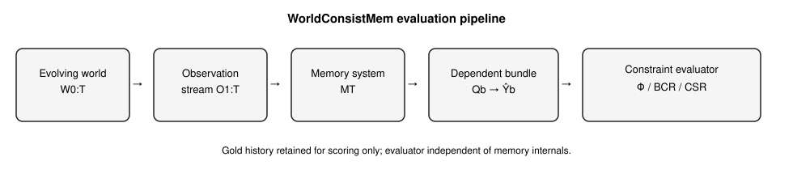
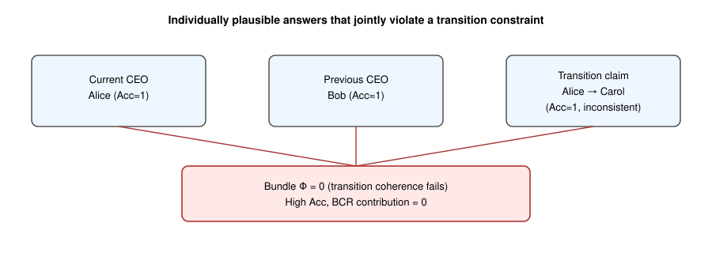
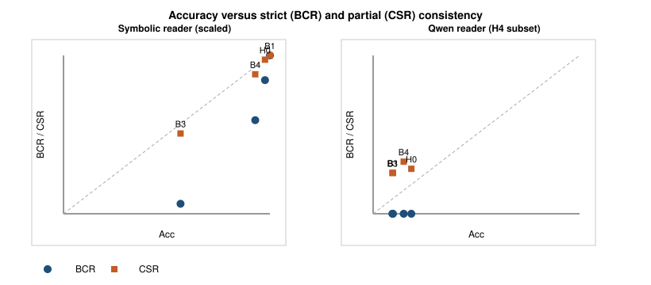
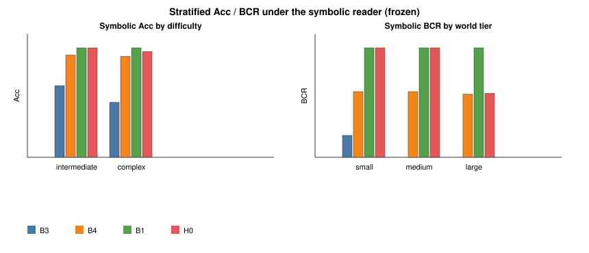
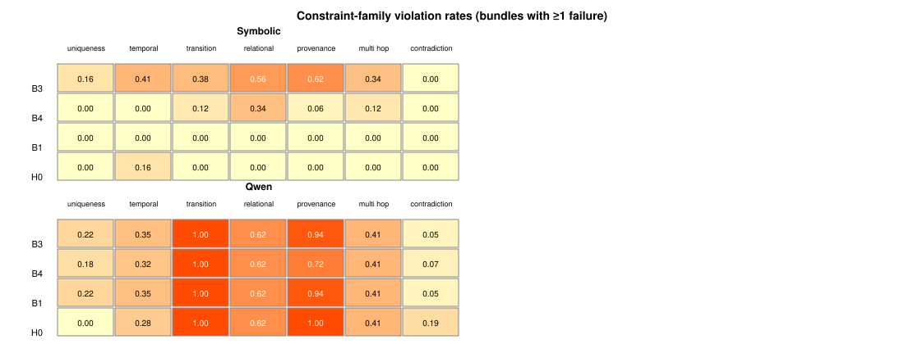

# WorldConsistMem: Cross-Query Consistency Evaluation for Long-Term Memory in Evolving Worlds

**Paper shape:** benchmark + evaluation methodology (not architecture).  
**Evidence freeze:** `experiments/worldconsistmem/outputs/scaled/FINAL_EXPERIMENT_STATUS.md`

## Abstract

Long-term memory systems support agents that operate over evolving interactions and changing world states. Most existing evaluations primarily report per-query or per-instance outcomes such as answer accuracy, retrieval fitness, conflict handling, or lifecycle metrics. These protocols leave open whether answers about the same persistent world jointly describe one coherent history.

We introduce an evaluation framework for cross-query world-history consistency. WorldConsistMem is a synthetic evolving-world benchmark based on dependent query bundles grounded in one deterministic gold history. Constraints are derived automatically from that history; a reader’s predicted answer set—conditioned on the memory state—is scored by machine-checkable predicates, independently of memory internals. Strict Bundle Consistency Rate (BCR) measures full constraint satisfaction; Constraint Satisfaction Rate (CSR) provides partial diagnostic resolution when BCR floors. We also report Acc–consistency gaps and ConsAcc diagnostics.

Across a corruption suite and a scaled symbolic study (102 worlds, 1,088 bundles, 7,140 queries), per-query accuracy and bundle consistency diverge: high Acc with BCR = 0 and low Acc with BCR = 1 both occur, and retrieval systems can retain high Acc while violating bundle constraints. Under a frozen Qwen reader on an H4 subset, BCR floors at 0 for all evaluated systems while mean CSR remains discriminative (about 0.26–0.33). The structured hierarchical reference attains the highest Acc (0.185) but not the strongest CSR (BM25 leads at 0.329); architecture superiority is not supported.

Contributions: (i) a formal cross-query consistency evaluation methodology; (ii) the WorldConsistMem benchmark; (iii) strict and partial consistency metrics (BCR, CSR, ConsAcc, gaps); (iv) an empirical characterization with released reference systems.

## Contents

1. Introduction  
2. Related Work  
3. Cross-Query Consistency in Evolving Worlds  
4. WorldConsistMem Benchmark  
5. Evaluation Metrics  
6. Evaluated Memory Systems  
7. Experimental Setup  
8. Results  
9. Consistency Failure Analysis  
10. Discussion and Limitations  
11. Conclusion  
Appendix A. Reproducibility  
Appendix B. Artifacts  

---

# 1. Introduction

Long-term memory systems increasingly support assistants and agents that operate across extended interactions and changing world states. As these systems store, update, and retrieve information over time, their answers are used for isolated facts and for decisions that depend on what is currently true, what was previously true, how transitions occurred, and which evidence supports those claims. Evaluating whether such systems preserve a usable record of an evolving world is therefore a central measurement problem for agent memory research. This paper does not claim that long-horizon memory itself is a new problem; it focuses on how consistency across dependent answers should be measured.

Most existing evaluations primarily report per-query or per-instance outcomes. Long-horizon memory benchmarks typically score answer accuracy, ability-specific accuracy, retrieval fitness, profile or lifecycle metrics, conflict handling, or temporal update success on individually graded questions [@wu2025longMemEval; @wu2026longMemEvalV2; @hu2025memoryAgentBench; @tao2026memConflict; @xie2026dynamicMem; @wang2026evoMemBench; @hu2026everMemBench; @liu2026worldMemArena]. These protocols are informative about what a system can recover under long histories, including temporal updates and conflict-sensitive retrieval. They leave open a complementary question: when several answers concern the *same* persistent world, do they jointly describe one coherent history?

Queries over one evolving world are dependent. Answers about current state, prior state, transitions, relations, provenance, and conflicts share entities, validity intervals, and evidence links. Individually plausible answers can still be mutually incompatible. For example, a system may name the correct current CEO and the correct previous CEO, yet assert an impossible transition between them, or report a provenance identifier that cannot support the stated historical claim. Per-query accuracy can remain high while the answer set fails as a world history.

We introduce an evaluation framework for cross-query world-history consistency. **WorldConsistMem** is an evolving synthetic-world benchmark based on *dependent query bundles* grounded in one deterministic gold history. After a memory system ingests an observation stream, a reader answers a bundle of interdependent questions spanning current, historical, transition, relational, provenance, and conflict-oriented slots. Constraints \(\mathcal{C}\) are derived automatically from the gold history and query slots; consistency is scored by machine-checkable predicates over the predicted answer set produced by that reader conditioned on the memory state, without requiring access to memory internals. Structured reference systems appear later for evaluation only, not as the lead contribution. The research question is:

> Under evolving synthetic worlds with dependent query bundles and machine-checkable cross-query constraints, do long-term memory systems that achieve non-trivial per-query accuracy also produce jointly consistent answer sets, and which partial-consistency diagnostics remain informative when strict bundle consistency floors?

WorldConsistMem operationalizes two complementary consistency metrics alongside accuracy. **Bundle Consistency Rate (BCR)** is strict global consistency: a bundle counts as consistent when every applicable constraint is satisfied. **Constraint Satisfaction Rate (CSR)** measures partial constraint satisfaction and provides diagnostic resolution when almost no bundle is fully consistent. We also report accuracy–consistency gaps (notably \(\mathrm{Gap}_{\mathrm{query}}=\mathrm{Acc}-\mathrm{BCR}\)) and related ConsAcc diagnostics. Under weaker readers, strict BCR may floor at zero even when systems differ in how many constraints they satisfy; CSR complements rather than replaces BCR.

Empirically, corruption and symbolic evaluations show Acc–consistency dissociation: high Acc with BCR \(=0\) and low Acc with BCR \(=1\) both occur, and scaled symbolic retrieval systems can retain high per-query Acc while violating bundle constraints. Under a Qwen reader on the frozen H4 subset, BCR floors at 0 across all evaluated systems while mean CSR remains discriminative (about 0.26–0.33). Among the evaluated Qwen reader systems, the structured hierarchical reference baseline attains the highest Acc (0.185) but not the strongest CSR (BM25 leads at 0.329). Architecture superiority is therefore not supported under the completed LLM evaluation; hierarchical H0 is released as a reference baseline for comparison.

**Contributions.**

1. **Formal evaluation methodology** for cross-query consistency of long-term memory systems over evolving worlds, using dependent query bundles and machine-checkable world-history constraints \(\Phi\).
2. **WorldConsistMem**, a synthetic evolving-world benchmark with shared gold histories, multi-family interdependent queries, and automatically derived constraints (102 worlds, 1,088 bundles, 7,140 queries in the scaled freeze).
3. **Strict and partial consistency metrics**—BCR, CSR, ConsAcc variants, and Acc–consistency gaps—that separate per-query accuracy from jointly coherent answer sets.
4. **Empirical characterization** of Acc–consistency dissociation under corruption, symbolic, and Qwen conditions, with released reference systems (including a structured hierarchical baseline) for reproducible comparison.

Adjacent work already separates accuracy from global logical coherence on multi-query case files [@salla2026crossQueryContradictions; @chaudhry2026logicVault]. Existing LTM benchmarks primarily emphasize long-horizon answer or stage metrics. Our residual lies at the intersection: persistent memory evaluation over evolving multi-entity worlds, where constraints arise from temporal validity, transitions, relations, provenance, and shared history. The remainder of the paper defines the evaluation object (Section 3), benchmark (Section 4), metrics (Section 5), reference systems (Section 6), setup (Section 7), results (Sections 8–9), and limitations (Section 10).

---

# 2. Related Work

We situate WorldConsistMem against long-term memory evaluation, evolving-knowledge benchmarks, conflict and temporal validity work, and adjacent cross-query logical consistency. The residual is not “memory over time” alone, nor “consistency” alone, but their intersection under machine-checkable world-history constraints.

## 2.1 Long-term memory evaluation

LongMemEval evaluates chat assistants on long-term interactive memory through five ability axes—information extraction, multi-session reasoning, temporal reasoning, knowledge updates, and abstention—with answer accuracy as the primary metric under long-history and long-context protocols [@wu2025longMemEval]. LongMemEval-V2 extends the agenda toward “experienced colleague” competence, adding dynamic state tracking, workflows, and premise awareness, again with per-question accuracy (and latency-oriented reporting) as the headline outcomes [@wu2026longMemEvalV2]. MemoryAgentBench evaluates agent memory via incremental multi-turn interactions across competencies such as accurate retrieval, test-time learning, long-range understanding, and selective forgetting / FactConsolidation after edits, scored primarily by task or answer accuracy [@hu2025memoryAgentBench]. EverMemBench targets long-horizon collaborative, multi-party dialogues and reports fine-grained recall, memory awareness, and profile understanding under QA accuracy protocols [@hu2026everMemBench]. EvoMemBench organizes agent memory from a self-evolving perspective with a scope×content taxonomy and reports task success or accuracy (and efficiency) across methods compared with long-context baselines [@wang2026evoMemBench]. Taken together, this line provides mature protocols for long-horizon Acc and ability factorization; the measurement gap we target is joint coherence of dependent answers, not another Acc axis.

These benchmarks primarily evaluate individual query or task outcomes. Several include temporal reasoning, updates, multi-hop questions, or profile-related abilities, and some diagnose retrieval bottlenecks or awareness failures. We do not imply that they contain no temporal or consistency-adjacent analysis. WorldConsistMem does not replace ability Acc suites. It additionally evaluates whether answers within a dependent bundle jointly satisfy constraints derived from one world history. The evaluation unit is the interdependent answer set \(\hat Y_b\) under \(\Phi(\hat Y_b;\mathcal{C}_b)\), not a single graded QA item. Existing LTM benchmarks primarily emphasize Acc (or closely related per-instance scores); they do not, as a primary object, report strict bundle consistency (BCR) and partial constraint satisfaction (CSR) over machine-derived world-history constraints. A comparative summary appears in Table 1.

## 2.2 Dynamic and evolving knowledge

Evolving worlds are not novel by themselves. DynamicMem constructs long-horizon personal memory in real-world settings and evaluates temporal checkpoint reconstruction and related state-tracking accuracy for evolving user attributes, habits, and preferences [@xie2026dynamicMem]. WorldMemArena evaluates multimodal agent memory through action–world interaction, diagnosing write, maintain, retrieve, and use stages under lifelong evolution and agentic execution protocols [@liu2026worldMemArena]. LongMemEval-V2 likewise treats dynamic tracking as an ability axis under per-question Acc [@wu2026longMemEvalV2]. EverMemBench and related dialog memory suites further emphasize temporally evolving decisions inside long collaborative histories [@hu2026everMemBench].

It is important to distinguish three notions that are easy to conflate. *Tracking changing state* asks whether the system recovers the correct value at a time or checkpoint. *Profile or lifecycle consistency* asks whether personal attributes, stage metrics, or write/use pipelines remain coherent for a user or agent trajectory. *Cross-query world-history consistency* asks whether interdependent answers about current state, historical state, transitions, relations, and provenance jointly satisfy constraints induced by one shared multi-entity gold history. DynamicMem’s temporal checkpoint evaluation is a strong form of evolving-state measurement for user profiles; it is not the same scientific object as WorldConsistMem’s \(\Phi\) over multi-view world bundles. WorldMemArena’s evolving personal/task states and stage diagnostics similarly measure lifecycle health under Acc, retrieval, and faithfulness-style metrics rather than machine-checkable cross-query world constraints. Related evolving-state suites therefore already motivate long-horizon evaluation; WorldConsistMem asks a narrower joint-answer question under shared gold-history constraints rather than treating evolution itself as the residual.

## 2.3 Conflict, temporal validity, and provenance

MemConflict evaluates long-term memory systems under dynamic, static, and conditional memory conflicts, combining black-box answer correctness with white-box retrieval and ranking diagnostics, and showing that answer correctness can diverge from retrieval fitness [@tao2026memConflict]. MemoryAgentBench’s selective-forgetting and FactConsolidation settings stress whether edited knowledge remains usable after updates [@hu2025memoryAgentBench]. LongMemEval and LongMemEval-V2 include knowledge-update and temporal abilities scored by Acc [@wu2025longMemEval; @wu2026longMemEvalV2]. These lines diagnose conflict handling, version validity, and temporal updates at the query, retrieval, or competency level. That diagnosis is valuable: conflict and update failures are real memory pathologies. The WorldConsistMem contrast is evaluation grain and joint structure rather than denial of those pathologies.

WorldConsistMem does not merely test choosing the currently valid fact after a conflict. A conflict- or update-correct single answer can still participate in an inconsistent bundle: the current attribute may be right while the transition explanation, historical role, relational neighbor, or provenance link fails jointly. Provenance and transition questions appear as core bundle members whose answers must agree with current and historical claims under automatically derived constraints. Provenance-oriented evaluation exists in broader NLP and IR settings; WorldConsistMem’s residual is placing provenance, transition, temporal, relational, and conflict-validity answers under one shared constraint set for memory-system evaluation. Adjacent conflict benchmarks primarily emphasize fitness-for-use or Acc under conflicting evidence, not strict and partial satisfaction of multi-query world-history constraints.

## 2.4 Cross-query logical consistency

Accuracy and global logical consistency have already been separated outside agent-memory evaluation. Salla et al. study case-file logical consistency across interdependent queries, introduce set-level metrics including Case Satisfiability and SetConsRate, and show that solver-augmented repair can raise global coherence while preserving per-query accuracy [@salla2026crossQueryContradictions]. LogicVault maintains persistent symbolic belief states verified with SMT-style checking and belief revision, and releases LogicBench-Cross for cross-query logical consistency evaluation [@chaudhry2026logicVault]. Machine-checkable constraint evaluation over multi-query answer sets is therefore not universally new, and Acc–consistency dissociation is already an established measurement theme in that literature.

The residual for WorldConsistMem is application domain and constraint origin. SetCons-style and LogicVault-style work target logical/case-file coherence: commitments extracted from multi-query reasoning instances must remain globally satisfiable. WorldConsistMem instantiates cross-query consistency for *persistent memory systems* over *evolving multi-entity worlds*, where constraints arise from temporal validity, transitions, relations, provenance, and shared history, and where the predicted answers must jointly reconstruct that evolving world history from an observation stream rather than standalone logical case files. Dependent query bundles, one deterministic gold world history retained for scoring, BCR, and CSR form the operational package. Adjacent logical-consistency work studies Acc–coherence separation for multi-query reasoning; WorldConsistMem evaluates whether memory-system answer sets induced by dependent query bundles jointly satisfy world-history-derived constraints under \(\Phi\).

**Summary.** Existing LTM benchmarks primarily emphasize per-query or per-instance outcomes under long histories, evolving state, conflict, or lifecycle protocols. Adjacent logical-consistency work already studies Acc–global-coherence separation for multi-query reasoning. Our residual lies at the intersection of persistent memory evaluation and world-history-derived cross-query constraints—measured by BCR, CSR, and explicit Acc–consistency gaps.

### Table 1. Closest related work

# Table 1. Closest related benchmarks and adjacent consistency work

Cells use **Yes** / **Partial** / **No**. Every cell is backed by `planning/final-citation-audit.md` and the novelty audit. Do **not** read “No” as “the work ignores the phenomenon entirely”—it means the feature is not the primary evaluation object as operationalized in WorldConsistMem.

| Benchmark / work | Long-term memory | Evolving state | Dependent query bundles | Shared gold history | Temporal / transition queries | Provenance | Cross-query machine constraints | Strict bundle consistency | Partial constraint satisfaction | Primary metric |
|---|---|---|---|---|---|---|---|---|---|---|
| LongMemEval [@wu2025longMemEval] | Yes | Partial^[a] | No | Partial^[b] | Partial^[c] | No | No | No | No | Ability Acc |
| LongMemEval-V2 [@wu2026longMemEvalV2] | Yes | Yes | No | Partial^[b] | Partial^[c] | No | No | No | No | Acc (+ latency) |
| MemoryAgentBench [@hu2025memoryAgentBench] | Yes | Partial^[a] | No | Partial^[b] | Partial^[c] | No | No | No | No | Competency Acc |
| EverMemBench [@hu2026everMemBench] | Yes | Yes | No | Partial^[b] | Partial^[c] | No | No | No | No | Recall / awareness / profile Acc |
| EvoMemBench [@wang2026evoMemBench] | Yes | Partial^[a] | No | Partial^[b] | No / Partial^[d] | No | No | No | No | Task Acc / success |
| MemConflict [@tao2026memConflict] | Yes | Partial^[a] | No | Partial^[b] | Partial^[c] | Partial^[e] | No / Partial^[f] | No | Partial^[g] | Conflict Acc + retrieval fitness |
| DynamicMem [@xie2026dynamicMem] | Yes | Yes | Partial^[h] | Yes^[i] | Partial^[c] | No | No / Partial^[f] | No | Partial^[g] | Checkpoint / service Acc |
| WorldMemArena [@liu2026worldMemArena] | Yes | Yes | Partial^[h] | Partial^[b] | Partial^[c] | Partial^[e] | No | No | Partial^[g] | Lifecycle Acc / faithfulness |
| SetCons metrics [@salla2026crossQueryContradictions] | No | No | Yes | Partial^[j] | Partial^[k] | No | Yes^[l] | Yes^[m] | Partial^[n] | SetCons / case satisfiability |
| LogicVault / LogicBench-Cross [@chaudhry2026logicVault] | No | No | Yes | Partial^[j] | Partial^[k] | No | Yes^[l] | Yes^[m] | Partial^[n] | Logical / SMT consistency |
| **WorldConsistMem (this work)** | **Yes** | **Yes** | **Yes** | **Yes** | **Yes** | **Yes** | **Yes** | **Yes (BCR)** | **Yes (CSR)** | **Acc + BCR + CSR** |

### Footnotes

^[a]: Evolving knowledge appears as updates, long sessions, or competency settings, not as a multi-entity gold world timeline scored by joint \(\Phi\).

^[b]: Histories or sessions provide shared context for questions, but scoring remains primarily per-query Acc rather than joint constraints over one retained gold world state sequence.

^[c]: Temporal or update abilities / questions exist; explicit *transition* queries jointly constrained with current/historical/provenance answers are not the primary object.

^[d]: Self-evolving taxonomy emphasizes scope×content mechanisms; temporal-transition bundles are not evidenced as a primary consistency suite (conservative Partial/No).

^[e]: Conflict or evidence diagnostics may touch support relations; provenance is not a first-class jointly constrained query family as in WorldConsistMem.

^[f]: May expose divergence between retrieval fitness and answer correctness, or checkpoint reconstruction error—adjacent to, but not identical with, machine-checkable cross-query world constraints \(\mathcal{C}_b\).

^[g]: Partial diagnostics exist (e.g., retrieval fitness, checkpoint completeness, stage metrics) but not CSR-style fraction of satisfied world-history constraints over dependent answer sets.

^[h]: Related probes or multi-stage evaluations can couple questions about one trajectory; not WorldConsistMem-style dependent bundles spanning current/historical/transition/provenance under shared \(\mathcal{C}_b\).

^[i]: DynamicMem retains evolving profile ground truth for checkpoint evaluation (user-centric gold state), distinct from multi-entity world-history bundles.

^[j]: Case-file or belief-state ground truth supports logical satisfiability; not an evolving multi-entity agent-memory world history.

^[k]: Logical entailment / contradiction structure may be temporal in content; not world-event transition constraints derived from a memory observation stream.

^[l]: SMT / set-level logical constraints over commitments—not world-history-derived temporal/transition/provenance/relational memory constraints.

^[m]: Global case satisfiability / SetCons-style strict coherence over multi-query instances.

^[n]: Contradiction density, revision cost, or related graded diagnostics exist; not WorldConsistMem CSR over world-history constraint families.

**Reading rule.** Columns “cross-query machine constraints,” “strict bundle consistency,” and “partial constraint satisfaction” are **Yes** for SetCons/LogicVault because those works evaluate multi-query logical coherence; WorldConsistMem’s residual is the *memory + evolving gold world* instantiation (Section 2.4), not inventing Acc–consistency separation.

---

# 3. Cross-Query Consistency in Evolving Worlds

This section defines the evaluation object independently of any particular memory architecture. The question is whether answers produced from a memory state about one evolving world jointly describe that world.

Figure 1 summarizes the evaluation pipeline from evolving world to constraint scoring.

## 3.1 Evolving world and observations

Let \(W_0,\ldots,W_T\) be a sequence of structured world states over a fixed entity vocabulary (persons, organizations, projects, documents, roles, ownership, and related relations). An event sequence \(E_{1:T}\) drives deterministic transitions

\[
W_t = \mathrm{Apply}(W_{t-1}, E_t).
\]

Each event carries a timestamp, typed payload, and provenance identifier. Validity intervals for roles and attributes are induced by start, end, transfer, and update events. The **gold history** \((W_{0:T}, E_{1:T})\) is retained for scoring and is never exposed directly to the memory system.

The system instead receives an **observation stream** \(O_{1:T}\) derived from \(E_{1:T}\) (canonical text and structured fields, optionally with distractors). After ingesting \(O_{1:T}\), the system holds an implementation-specific memory state \(M_T\). Because the reader conditions its predictions on \(M_T\), differences in what each memory system retains can change \(\hat Y_b\) and therefore affect \(\Phi\) and the consistency rates defined in Section 5.

## 3.2 Dependent query bundles

A **query bundle** \(Q_b = \{q_1,\ldots,q_{n_b}\}\) is a finite set of queries about the **same** world and focal entity or relation cluster (for example, the CEO lineage of one organization, or the ownership chain of one project). Bundle members are intentionally dependent: they ask for current state, historical state, transitions, temporal order, provenance, multi-hop relations, contradictions, counterfactuals, or conflict validity over shared entities and times.

Gold answers \(Y_b^* = \{y_i^*\}\) are derived only from \((W_{0:T}, E_{1:T})\). Predictions \(\hat Y_b = \{\hat y_i\}\) are produced by a reader conditioned on \(M_T\) (and optional retrieved evidence). Per-query accuracy compares \(\hat y_i\) to \(y_i^*\) under structured equality. Accuracy alone does not ask whether the predicted answers are jointly coherent.

## 3.3 Automatically derived constraints and \(\Phi\)

From the gold history and the bundle’s query slots we derive a finite set of machine-checkable constraints \(\mathcal{C}_b\) over predicted answers (and, where applicable, predicted provenance). Constraint families include uniqueness, temporal order, transition coherence, relational agreement, provenance support, multi-hop composition, and contradiction/conflict validity. Constraints are predicates on \(\hat Y_b\); they do not require re-running the memory system.

Define the consistency predicate

\[
\Phi(\hat Y_b;\mathcal{C}_b)
=
\begin{cases}
1 & \text{if every } c\in\mathcal{C}_b \text{ holds on }\hat Y_b,\\
0 & \text{otherwise.}
\end{cases}
\]

When \(\mathcal{C}_b=\emptyset\), we take \(\Phi=1\) (vacuous consistency). Strict bundle consistency is \(\Phi=1\); Section 5 defines aggregate rates and partial satisfaction.

## 3.4 Accuracy versus world consistency

Two failure modes motivate the separation:

**High accuracy, inconsistent answers.** A system may correctly name the current CEO and the previous CEO while asserting a transition time or provenance that cannot reconcile those two facts. Per-query Acc can remain high while \(\Phi=0\) (Figure 2).

**Low accuracy, internally consistent alternative world.** A system may answer an entire bundle with a coherent but wrong ownership lineage (consistent among themselves, wrong relative to gold). Then Acc is low while \(\Phi=1\). Consistency is therefore not a proxy for correctness; it measures joint coherence of the answer set as a candidate world description.

The evaluation object is this Acc–\(\Phi\) distinction for **memory systems** over evolving multi-entity worlds. Adjacent multi-query logical consistency work studies Acc versus global coherence for reasoning/SAT settings [@salla2026crossQueryContradictions; @chaudhry2026logicVault]; the present object is constraint checking of memory answers against **world-history-derived** predicates, not SMT satisfiability of logical commitments alone.

## 3.5 Implementation independence

Any system that maps observation streams to a memory state and answers queries—flat stores, retrieval pipelines, structured hierarchical stores, or LLM readers over retrieved evidence—can be scored with the same \((Q_b, Y_b^*, \mathcal{C}_b)\) protocol. The formal object does not privilege any particular multi-store layout.

---

# 4. WorldConsistMem Benchmark

WorldConsistMem is a deterministic synthetic benchmark that instantiates Section 3. It is designed so that consistency constraints are automatically derived from a shared gold history, and so that bundles are not bags of unrelated questions.

## 4.1 Entities, events, and validity

Worlds contain typed entities (persons, organizations, projects, documents, locations) and relations (employment/CEO roles, ownership, membership, document versions, dependencies). An event grammar emits start, end, transfer, update, and related lifecycle events. Role and attribute assertions induce **validity intervals**. Each event carries a **provenance** identifier used by provenance queries and provenance constraints.

Generation is seed-deterministic. Given a seed and tier, the world, event log, observation stream, bundles, gold answers, and applicable constraints are fixed.

## 4.2 Observation stream

Systems never read gold \(W_t\) directly. They ingest an observation stream: structured fields plus canonical text (and, in smoke settings, paraphrases/distractors as configured). Observations are the only channel through which event information enters memory.

## 4.3 Query-bundle generation and families

For each focal lifecycle (for example, a CEO succession or project ownership chain), the generator emits a **bundle** whose queries share that focus and therefore share entities, times, and supporting events. Query families include:

- current state;
- historical state;
- transition;
- temporal order;
- provenance;
- multi-hop;
- contradiction;
- counterfactual;
- conflict validity.

**Why bundles are not unrelated questions.** Bundle members are linked by construction: answering “who is CEO now,” “who was CEO before,” “when did the change occur,” and “what evidence supports the current role” refers to one succession. Constraints such as transition coherence and provenance support are meaningful only because those answers must agree. A shuffled pool of independent factual questions would not induce the same \(\mathcal{C}_b\).

## 4.4 Constraint derivation

Constraints are compiled from gold history and query slots (uniqueness of exclusive roles, temporal order of events, transition payload agreement with current/historical answers, relational closure for multi-hop items, provenance alignment, contradiction/conflict rules). The evaluator applies \(\mathcal{C}_b\) to predictions without consulting the memory implementation’s internals.

## 4.5 Dataset scale and roles

Dataset scale is summarized in Table 2.

**Scaled benchmark** (seed 100; frozen; Table 2):

| Quantity | Value |
|---|---:|
| Worlds | 102 (34 small / 34 medium / 34 large) |
| Bundles | 1,088 |
| Queries | 7,140 |

Tier differ in event volume (mean events per world: 35 / 97 / 215). Bundle difficulty labels (`intermediate`, `complex`) are structural annotations for stratified reporting.

**Smoke benchmark** (frozen checksum `3aa67ed1…`): 25 worlds, 125 bundles, 825 queries. Smoke confirms gold metrics (Acc = BCR = ConsAcc = 1) and the corruption suite that separates Acc from \(\Phi\). Scaled evaluation reuses the same metric and constraint path; smoke is the regression lock, scaled is the primary empirical setting.

**H4 LLM subset** (frozen protocol): first 6 worlds per tier (18 worlds), 192 bundles, 1,260 queries, used only for the local Qwen reader study (Section 7–8). Symbolic scaled results use the full 102-world set unless noted.

## 4.6 Scope statement

WorldConsistMem is a controlled synthetic-world benchmark. Its purpose is to make Acc and joint world-answer consistency separately measurable under identical gold histories and constraints. Ecological and deployment limits are stated in Section 10.3.

### Table 2. WorldConsistMem dataset statistics (scaled freeze)

| Quantity | Value |
|---|---:|
| Worlds | 102 (34 small / 34 medium / 34 large) |
| Bundles | 1088 |
| Queries | 7140 |
| Intermediate / complex bundles | 340 / 748 |
| Mean events (small / medium / large) | 35 / 97 / 215 |
| Smoke checksum (prefix) | `3aa67ed1…` |
| H4 LLM subset | 18 worlds, 192 bundles, 1,260 queries |

Query-family counts (scaled): current/historical/transition/multi-hop/provenance = 1088 each; temporal_order/conflict_validity = 442; contradiction/counterfactual = 408.

---

# 5. Evaluation Metrics

Metrics are reported jointly. We do not collapse evaluation into a single headline score. Strict BCR remains the primary consistency rate; CSR and partial ConsAcc are complementary diagnostics, especially when BCR floors.

## 5.1 Per-query accuracy

For query \(q_i\) with gold \(y_i^*\) and prediction \(\hat y_i\),

\[
\mathrm{Acc}_i = \mathbf{1}[\hat y_i \equiv y_i^*]
\]

under structured equality (IDs, times, relation slots). Mean query accuracy \(\mathrm{Acc}\) averages \(\mathrm{Acc}_i\) over all scored queries. We also report accuracy by query family.

## 5.2 Bundle Consistency Rate (BCR)

Let \(B\) be the set of bundles. With \(\Phi\) as in Section 3,

\[
\mathrm{BCR}
=
\frac{1}{|B|}
\sum_{b\in B}
\mathbf{1}\bigl[\Phi(\hat Y_b;\mathcal{C}_b)=1\bigr].
\]

BCR is **strict**: a single violated applicable constraint yields \(\Phi=0\) for that bundle. Under weak readers, BCR can floor at zero even when systems differ in how many constraints they satisfy.

## 5.3 Constraint Satisfaction Rate (CSR)

For bundle \(b\),

\[
\mathrm{CSR}_b
=
\frac{\#\{\text{satisfied constraints in }b\}}
{\#\{\text{applicable constraints in }b\}},
\]

with \(\mathrm{CSR}_b=1\) when \(\mathcal{C}_b=\emptyset\). Equivalently, \(\mathrm{BCR}\) is the fraction of bundles with \(\mathrm{CSR}_b=1\). We report mean and median CSR, CSR distributions, CSR by constraint family, and CSR by difficulty/tier.

**Violations per bundle.** We report the mean/median number of violated constraints and normalized violations \(\mathrm{CSR}_b\)’s complement \(1-\mathrm{CSR}_b\) when \(|\mathcal{C}_b|>0\).

CSR does **not** replace BCR. It provides resolution when almost no bundle is fully consistent.

## 5.4 Consistency-aware accuracy

**Strict ConsAcc.** Fraction of bundles that are fully correct (\(\mathrm{Acc}_i=1\) for all \(i\in Q_b\)) **and** \(\Phi=1\).

**Relaxed / partial ConsAcc.** (i) Relaxed ConsAcc: mean query Acc on the bundle \(\ge \tau\) and \(\Phi=1\) (default \(\tau=0.8\)). (ii) Partial ConsAcc grid \(\mathrm{PConsAcc}_{\tau,\tau_c}\): fraction of bundles with mean query Acc \(\ge \tau\) and \(\mathrm{CSR}_b\ge \tau_c\), for predeclared \(\tau\in\{0.5,0.8\}\) and \(\tau_c\in\{0.8,0.9\}\). We report the **full grid**; we do not cherry-pick a favorable cell as a primary claim.

## 5.5 Accuracy–consistency gaps

**Primary gap (\(\mathrm{Gap}_{\mathrm{query}}\)):**

\[
\mathrm{Gap}_{\mathrm{query}} = \mathrm{Acc} - \mathrm{BCR}.
\]

**Secondary gap (\(\mathrm{Gap}_{\mathrm{bundle}}\)):**

\[
\mathrm{Gap}_{\mathrm{bundle}} = \mathrm{Acc}_{\mathrm{bundle}} - \mathrm{ConsAcc}_{\mathrm{strict}},
\]

where \(\mathrm{Acc}_{\mathrm{bundle}}\) is the fraction of bundles with all answers individually correct.

Large positive \(\mathrm{Gap}_{\mathrm{query}}\) indicates high per-query Acc relative to strict joint consistency.

## 5.6 Family diagnostics

- **Temporal consistency / temporal violation rate:** bundles with at least one failed temporal or transition constraint.  
- **Provenance consistency / provenance violation rate:** bundles with at least one failed provenance constraint.  
- **Constraint-family violation rates:** fraction of bundles with \(\ge 1\) failure in each family (uniqueness, temporal, transition, relational, provenance, multi-hop, contradiction).  
- **High-accuracy inconsistent rate:** fraction of bundles with mean Acc \(\ge 0.8\) and \(\Phi=0\).  
- **Abstention and malformed rates** (LLM readers): fraction of queries marked abstain or unparsable under the frozen parser.

## 5.7 Statistical protocol

Primary units for confidence intervals are **worlds**, not queries. We report world-level bootstrap 95% CIs for Acc, BCR, ConsAcc, and CSR where applicable. Queries within a bundle are not treated as independent samples.

---

# 6. Evaluated Memory Systems

Systems are **reference implementations** for evaluation. We describe them factually. We do not claim architectural superiority for any design, including the structured hierarchical reference.

## 6.1 Oracle and flat stores

- **Oracle / gold.** Predictions equal gold answers (validation upper bound; Acc = BCR = 1 on well-formed bundles).  
- **Flat append-only (unconstrained).** All observations retained; reader consults the full store.  
- **Latest-only.** Retain only the most recent observation(s) under a simple currency rule; older evidence is discarded.  
- **Capacity-limited flat.** Fixed logical-record budget with eviction: **recency**, **compact padding** (drop low-priority padding/status noise first), or **reservoir** sampling.

## 6.2 Retrieval baselines

- **Recency-\(k\).** Retrieve the \(k\) most recent observations.  
- **BM25-\(k\).** Lexical retrieval of top-\(k\) observations for the query text.  

Reported operating points include \(k\in\{3,8\}\) under the frozen scaled protocol.

## 6.3 Structured hierarchical reference (H0)

H0 is a structured lifecycle-aware store with multiple internal components (working/session-style buffers, long-term assertions with validity, graph edges, provenance, archive/conflict bookkeeping, as implemented in the frozen experiment). At query time it returns an evidence pack under a retrieval budget (e.g., `ret8` at capacity 150).

**Role in the paper.** H0 is a **reproducible structured baseline**, not presented as a superior architecture. Symbolic matched-budget comparisons and the Qwen reader study report Acc and consistency for H0 under the WorldConsistMem metrics. Completed Qwen results do **not** support a consistency advantage for H0 (Section 8).

## 6.4 Readers

- **Symbolic / deterministic reader.** Exact structured matching over retrieved or stored records (primary scaled symbolic tables).  
- **Local LLM reader.** `mlx-community/Qwen2.5-3B-Instruct-4bit` with frozen prompt, temperature 0, max tokens, JSON early-stop, and parser (H4 subset).  

Evidence packs are isolated per query under the frozen H4 protocol so that cross-query leakage through the prompt is not an uncontrolled confound.

## 6.5 Fairness limitations (explicit)

Comparisons are informative but not perfectly matched:

- **Internal structure differs** (flat list vs multi-store H0).  
- **Capacity accounting** charges H0 metadata (graph, provenance, indices) against the same logical-record budgets used for flat stores; absolute budgets therefore tax structured metadata.  
- **Retrieval budgets** (\(k\) vs store-routed packs) are matched numerically where stated, but lexical BM25 is not identical to H0’s routing.  
- **Deterministic vs LLM readers** are separate conditions; symbolic Acc/BCR must not be pooled with Qwen Acc/BCR.  
- **Compact flat** can retain focal lifecycle events by dropping padding, which can yield very high symbolic Acc/BCR at medium budgets; this is a fairness caveat for matched-budget interpretation, not a general ranking of store designs.

These limits bound interpretation: gaps support metric claims; they do not license claims of architectural superiority.

---

# 7. Experimental Setup

All results in Sections 8–9 use **frozen** artefacts. No weights, prompts, metrics, or datasets were altered for this manuscript.

## 7.1 Conditions

**Symbolic reader condition.** Full scaled WorldConsistMem (102 worlds, 1,088 bundles, 7,140 queries). Systems include flat, latest-only, recency/BM25 retrieval, reservoir, capacity-matched flats, H0 capacity/retrieval points, and selective ablations. Predictions are stored under `outputs/scaled/predictions/`.

**Qwen reader condition (H4 Option A).** Model `mlx-community/Qwen2.5-3B-Instruct-4bit`. Subset: 18 worlds, 192 bundles, 1,260 queries. Systems: `B1_flat_cap150_compact`, `B3_recency_k8`, `B4_bm25_k8`, `H0_ltkm_cap150_ret8`. Run1+Run2 caches are frozen; Phi was not used for the final Option A decision.

## 7.2 Evidence isolation and decoding freeze

For H4, each query receives an isolated evidence pack produced by the system under its retrieval/budget rules; prompts, temperature (0), max tokens (48), evidence item cap, JSON early-stop via streaming generation, and parser are frozen (`prompt_v3_k3_mt48`). Cache keys embed model, system, query, and decoding tag. Integrity hashes for smoke, Run1 Qwen cache, and symbolic `system_results.csv` are recorded in `FINAL_EXPERIMENT_STATUS.md`.

## 7.3 Budgets and strata

Logical-record capacities include 60 / 150 / 400 (and unconstrained). Retrieval \(k\in\{3,8\}\). We stratify by world tier (small/medium/large) and bundle difficulty where reported. Constraint-family violation rates and CSR-by-family are computed from the same evaluator path as BCR.

## 7.4 Corruption validation

On smoke, controlled corruptions (single-answer edits, entity swaps, temporal mismatches, wrong provenance, transition/multihop inconsistencies, high-Acc inconsistent, consistent-wrong-world) confirm that Acc and \(\Phi\) can move in opposite directions (Section 8.1). Gold predictions achieve Acc = BCR = 1.

## 7.5 Statistics

World-level bootstrap 95% CIs; no query-level independence assumption. Symbolic and Qwen tables are reported **separately**.

## 7.6 Partial consistency recompute

CSR, violations, and PConsAcc grids are recomputed offline from frozen predictions (`partial_consistency_*.csv`). This step does not regenerate answers.

---

# 8. Results

We organize results around five questions. Symbolic and Qwen conditions are never pooled.

## 8.1 Are accuracy and consistency distinct?

**Corruption suite (smoke).** Gold predictions attain Acc = BCR = ConsAcc = 1. Controlled corruptions separate the metrics. Representative frozen values (Table 7):

| Corruption | Acc | BCR | Gap_query |
|---|---:|---:|---:|
| high_acc_inconsistent | 0.849 | 0.000 | 0.849 |
| wrong_provenance | 0.849 | 0.000 | 0.849 |
| consistent_wrong_world | 0.394 | 1.000 | −0.606 |
| transition_inconsistency | 0.939 | 0.600 | 0.339 |

High Acc with BCR = 0 and low Acc with BCR = 1 both occur. This supports that \(\Phi\) is not redundant with Acc.

## 8.2 Does the distinction persist at scale?

**Symbolic scaled (102 worlds).** Retrieval baselines show large Acc–BCR gaps. Frozen point estimates (Table 3; Figure 3 left):

| System | Acc | BCR | Gap_query | mean CSR (recompute) |
|---|---:|---:|---:|---:|
| B3_recency_k8 | 0.567 | 0.063 | 0.504 | 0.507 |
| B4_bm25_k8 | 0.929 | 0.591 | 0.338 | 0.881 |
| B1_flat_cap150_compact | 1.000 | 1.000 | 0.000 | 1.000 |
| H0_ltkm_cap150_ret8 | 0.976 | 0.844 | 0.132 | 0.973 |

B4 retains high Acc while BCR remains materially lower (\(\mathrm{Gap}_{\mathrm{query}} = 0.338\)). The Acc–consistency distinction survives scaling under the deterministic reader. World-level bootstrap CIs are reported in the frozen statistical analysis artefacts.

## 8.3 Which systems show the largest gaps?

Under the symbolic reader, **recency retrieval** exhibits the largest \(\mathrm{Gap}_{\mathrm{query}}\) among the headline retrieval points (0.504). **BM25** narrows but does not close the gap. **Compact flat at capacity 150** saturates Acc and BCR in this generator regime (fairness caveat: padding eviction can preserve focal lifecycle evidence; Section 6.5). **H0 at cap150/ret8** achieves high Acc and high BCR/CSR, but does **not** beat compact flat on BCR (ΔBCR vs compact = −0.156 at this point; matched lift vs compact fails the frozen gate). H0 does beat matched **recency** flat on BCR in the frozen capacity study; that is a matched-baseline comparison, not a claim of architectural superiority over all flat stores.

Selective ablations (archive, temporal-validity, graph, conflict) produce family-level Acc drops in the frozen ablation table; they are diagnostic of component–family links under the symbolic reader, not evidence that a multi-component store is necessary. Stratified Acc/BCR by difficulty and tier are shown in Figure 5.

## 8.4 What happens under the Qwen reader?

**H4 subset; frozen Qwen Option A.** All four systems have **BCR = 0**. Acc remains non-trivial and ordered (Table 4; Figure 3 right):

| System | Acc | BCR | mean CSR | Abs | Mal |
|---|---:|---:|---:|---:|---:|
| B1_flat_cap150_compact | 0.096 | 0 | 0.258 | 0.728 | 0.007 |
| B3_recency_k8 | 0.093 | 0 | 0.258 | 0.728 | 0.007 |
| B4_bm25_k8 | 0.148 | 0 | **0.329** | 0.579 | 0.001 |
| H0_ltkm_cap150_ret8 | **0.185** | 0 | 0.284 | 0.483 | 0.029 |

Because the constraint suite is satisfiable for gold/oracle predictions and yields non-trivial BCR on the deterministic symbolic reader (see Section 4.5 smoke confirmation and Section 8.2 symbolic results), the Qwen BCR floor reflects difficulty in producing jointly constraint-satisfying answers under this frozen reader/parsing pipeline, not an intrinsically inconsistent constraint definition.

**Reading:**

- In this Qwen setting, H0 has the **highest Acc** and lower abstention than flats/recency.  
- B4 has the **highest CSR**.  
- H0’s CSR is above B1/B3 (+0.026) but **below B4 (−0.045)**.  
- **No architecture consistency advantage is supported** under Qwen: BCR ties at 0; CSR does not rank H0 highest.  
- Acc gains must not be converted into consistency claims.

PConsAcc grid cells at \((\tau,\tau_c)\in\{0.5,0.8\}\times\{0.8,0.9\}\) are all 0 under Qwen: no bundle jointly clears the predeclared Acc and CSR thresholds.

## 8.5 Does CSR provide resolution when BCR floors?

Yes, within limits. With BCR = 0 for all Qwen systems, mean CSR still separates B4 (0.329) from B1/B3 (0.258) and H0 (0.284). Mean violations per bundle remain high (≈3.3–3.6). Acc–CSR Pearson correlation is positive for B1/B3/B4 (≈0.30–0.43) but near zero/slightly negative for H0 (−0.04), consistent with H0 answering more questions without proportional joint constraint satisfaction.

**Conclusion of Section 8.** Acc and consistency are empirically distinct; the distinction persists symbolically at scale; under Qwen, strict BCR floors while CSR remains weakly diagnostic; the structured reference H0 is not supported as a consistency winner under Qwen.

### Table 7. Corruption-suite validation (smoke; frozen)

| Corruption | Acc | BCR | Gap_query |
|---|---:|---:|---:|
| high_acc_inconsistent | 0.849 | 0.000 | 0.849 |
| wrong_provenance | 0.849 | 0.000 | 0.849 |
| consistent_wrong_world | 0.394 | 1.000 | −0.606 |
| transition_inconsistency | 0.939 | 0.600 | 0.339 |

Gold predictions attain Acc = BCR = ConsAcc = 1.

### Table 3. Symbolic scaled results (102 worlds; frozen)

| System | Acc | BCR | Gap_query | mean CSR |
|---|---:|---:|---:|---:|
| B3_recency_k8 | 0.567 | 0.062 | 0.504 | 0.507 |
| B4_bm25_k8 | 0.929 | 0.591 | 0.338 | 0.881 |
| B1_flat_cap150_compact | 1.000 | 1.000 | 0.000 | 1.000 |
| H0_ltkm_cap150_ret8 | 0.976 | 0.844 | 0.132 | 0.973 |

### Table 4. Qwen H4 Option A results (18 worlds, 192 bundles; frozen)

| System | Acc | BCR | mean CSR | Abs | Mal |
|---|---:|---:|---:|---:|---:|
| B3_recency_k8 | 0.093 | 0 | 0.258 | 0.728 | 0.007 |
| B4_bm25_k8 | 0.148 | 0 | 0.329 | 0.579 | 0.001 |
| B1_flat_cap150_compact | 0.096 | 0 | 0.258 | 0.728 | 0.007 |
| H0_ltkm_cap150_ret8 | 0.185 | 0 | 0.284 | 0.482 | 0.029 |

All PConsAcc grid cells at $(\tau,\tau_c)\in\{0.5,0.8\}\times\{0.8,0.9\}$ are 0 under Qwen.

---

# 9. Consistency Failure Analysis

This section localizes failures under the frozen Qwen condition and contrasts them with symbolic error patterns. Counts refer to bundles with at least one violation in a family unless noted.

## 9.1 Qwen: widespread multiple violations

For all four Qwen systems, **transition** constraints fail on **192/192** bundles in the H4 subset. Failures are not explained by a single rare constraint on an otherwise consistent bundle:

| System | Mean viol./bundle | Frac. exactly one viol. | Frac. multiple viol. |
|---|---:|---:|---:|
| B1 compact | 3.59 | 0.031 | 0.969 |
| B3 recency | 3.59 | 0.031 | 0.969 |
| B4 BM25 | 3.33 | 0.177 | 0.823 |
| H0 reference | 3.50 | 0.000 | 1.000 |

**BCR = 0** under Qwen therefore reflects **widespread multi-constraint inconsistency**, not one recurring isolated miss.

## 9.2 Constraint families (Qwen)

Approximate family hit counts (bundles with ≥1 failure; frozen diagnostics; Table 6; Figure 4):

| Family | B1 / B3 | B4 | H0 |
|---|---:|---:|---:|
| transition | 192 | 192 | 192 |
| provenance | 180 | 139 | 192 |
| relational | 120 | 120 | 120 |
| multi-hop | 78 | 78 | 78 |
| temporal | 68 | 62 | 54 |
| uniqueness | 42 | 34 | 0 |
| contradiction | 10 | 14 | 36 |

Query-family Acc under Qwen is reported in Table 5. Transition and provenance dominate. H0 reduces uniqueness hits to zero in this snapshot but **increases** contradiction hits and still fails every transition constraint. B4 reduces provenance hits relative to B1/B3, aligning with its higher CSR.

## 9.3 Abstention and malformed output

Qwen abstention is high for B1/B3 (0.728), lower for B4 (0.579) and H0 (0.483). Malformed rates remain low for flats/BM25 (≤0.007) and higher for H0 (0.029). Lower abstention with higher Acc under H0 does not restore BCR; some additional answered queries still violate joint constraints (near-zero Acc–CSR correlation).

## 9.4 Evidence availability versus reader composition

Symbolic BM25 and H0 can place correct evidence in scope and still show Acc–BCR gaps; under Qwen, error decomposition emphasizes **reader composition** failures even when retrieval improves Acc. Frozen H4 notes include non-zero reader-failure-on-correct-evidence rates. The methodological implication suggested by the decomposition is consistent with the observed pattern that improving evidence can shift Acc without necessarily restoring \(\Phi=1\) under this frozen evaluation pipeline.

## 9.5 Symbolic contrast (brief)

Under the deterministic reader, family Acc and BCR are much higher; gaps concentrate on retrieval/capacity regimes (e.g., recency) rather than universal transition collapse. Ablations link archive/temporal/graph components to family Acc drops. This contrast indicates that Qwen BCR flooring is reader-regime-specific, not a claim that the constraint suite is unsatisfiable in principle (gold and strong symbolic systems achieve BCR = 1).

### Table 5. Query-family Acc under Qwen (H4; frozen)

| Family | B1 compact | B3 recency | B4 BM25 | H0 |
|---|---:|---:|---:|---:|
| current_state | 0.010 | 0.010 | 0.083 | 0.542 |
| historical_state | 0.162 | 0.162 | 0.089 | 0.547 |
| transition | 0.000 | 0.000 | 0.000 | 0.000 |
| multi_hop | 0.000 | 0.000 | 0.052 | 0.000 |
| provenance | 0.188 | 0.167 | 0.417 | 0.000 |
| temporal_order | 0.128 | 0.128 | 0.205 | 0.308 |
| contradiction | 0.083 | 0.083 | 0.167 | 0.000 |
| counterfactual | 0.000 | 0.000 | 0.000 | 0.000 |
| conflict_validity | 0.462 | 0.462 | 0.462 | 0.000 |

Source: `qwen_system_results.csv` family_accuracy fields.

### Table 6. Constraint-family violation rates (headline systems)

**Symbolic** (fraction of bundles with ≥1 failure):

| Family | B3 recency | B4 BM25 | B1 compact | H0 |
|---|---:|---:|---:|---:|
| uniqueness | 0.156 | 0.000 | 0.000 | 0.000 |
| temporal | 0.406 | 0.000 | 0.000 | 0.156 |
| transition | 0.375 | 0.120 | 0.000 | 0.000 |
| relational | 0.562 | 0.343 | 0.000 | 0.000 |
| provenance | 0.625 | 0.057 | 0.000 | 0.000 |
| multi_hop | 0.344 | 0.124 | 0.000 | 0.000 |
| contradiction | 0.000 | 0.000 | 0.000 | 0.000 |

**Qwen** (same systems):

| Family | B1 / B3 | B4 | H0 |
|---|---:|---:|---:|
| transition | 1.000 | 1.000 | 1.000 |
| provenance | 0.938 | 0.724 | 1.000 |
| relational | 0.625 | 0.625 | 0.625 |
| multi_hop | 0.406 | 0.406 | 0.406 |
| temporal | 0.354 | 0.323 | 0.281 |
| uniqueness | 0.219 | 0.177 | 0.000 |
| contradiction | 0.052 | 0.073 | 0.188 |

---

# 10. Discussion and Limitations

## 10.1 What the residual supports

WorldConsistMem’s residual is methodological: dependent bundles over one gold evolving world, machine-checkable cross-query constraints, BCR, and CSR make Acc and joint world-answer consistency separately measurable for memory systems. Completed evidence is consistent with these quantities diverging under corruption, symbolic retrieval baselines, and a local Qwen reader.

## 10.2 Strict versus partial consistency

BCR is the right strict rate for “fully coherent bundle.” When BCR floors, CSR and violation distributions remain informative and should be reported. Partial ConsAcc grids should be reported in full; they are not a license to replace BCR with a favorable threshold cell.

## 10.3 Synthetic-world and template limits

Worlds are synthetic; observations are templated; ecological validity for open-domain conversation is **not** claimed. Difficulty labels are structural. Results characterize controlled WorldConsistMem regimes, not production assistants.

## 10.4 Reader limits

The LLM condition uses a single local 3B-class Qwen model with frozen short-form JSON decoding. Stronger models, cloud APIs, and Phi were not part of the frozen Option A decision. Low Acc and high abstention limit how far Qwen tables can speak to “human-level” memory behavior; they remain valid for the Acc≠consistency and BCR-floor/CSR questions under this reader.

## 10.5 Compact-flat strength and fairness

Under symbolic matched budgets, compact flat can match or exceed H0 on BCR by discarding padding while retaining focal events; capacity accounting taxes H0 metadata (Section 6.5). Structure is a reference design under test, not a proven necessity.

## 10.6 Negative architecture result under Qwen

The hierarchical reference does **not** earn a consistency win under Qwen (BCR = 0 for all; CSR highest for BM25). Within the frozen Qwen evaluation, Acc improvements and structural memory do not reliably yield joint coherence. This negative result is reported as a limitation of architecture claims under WorldConsistMem, not as a contribution headline.

## 10.7 Adjacent logical-consistency literature

As discussed in Section 2.4, cross-query logical consistency work [@salla2026crossQueryContradictions; @chaudhry2026logicVault] already separates Acc from global coherence for multi-query reasoning, but not for persistent memory systems over evolving multi-entity gold worlds with world-history-derived constraints.

Coverage bounds for the frozen evaluation are summarized in Table 8.

## 10.8 Proper scope of conclusions

Safe conclusions: Acc≠consistency for this benchmark; BCR can floor; CSR can still separate systems; architecture superiority is unsupported under the frozen Qwen protocol.  
Unsafe conclusions: real-world generality; state-of-the-art rankings; necessity of hierarchy; BCR sufficiency alone in low-Acc regimes without CSR.

### Table 8. Evaluation coverage and hard limits (frozen)

| Dimension | Coverage |
|---|---|
| Paper shape | Benchmark + evaluation methodology |
| Symbolic reader | Full scaled (102 worlds / 1,088 bundles / 7,140 queries) |
| LLM reader | Qwen2.5-3B-Instruct-4bit; H4 subset only |
| Phi / cloud models | Not run for Option A |
| Architecture superiority | Unsupported under Qwen (all BCR = 0) |
| Ecological validity | Not claimed (synthetic worlds) |
| Primary consistency metric | BCR (strict); CSR complementary |

---

# 11. Conclusion

We presented WorldConsistMem, a benchmark and evaluation methodology for cross-query consistency of long-term memory systems over evolving synthetic worlds. Dependent query bundles, a shared gold history, and machine-checkable world-history constraints make per-query Acc and jointly coherent answer sets separately measurable via BCR, CSR, ConsAcc, and Acc–consistency gaps.

Frozen evidence supports four scoped findings. First, Acc and consistency are empirically distinct under corruption and at symbolic scale. Second, high-Acc retrieval regimes can still violate temporal, relational, transition, and provenance constraints across dependent queries. Third, under the completed Qwen H4 protocol, strict BCR floors while CSR remains weakly discriminative. Fourth, the structured hierarchical reference is not supported as a consistency winner under Qwen.

These conclusions are limited to synthetic worlds, exact-match Acc, the frozen constraint library, and a single local 3B-class reader. They do not establish real-world generality, state-of-the-art rankings, or necessity of hierarchical memory. Within those bounds, WorldConsistMem operationalizes a residual measurement object at the intersection of persistent memory evaluation and world-history-derived cross-query constraints.

---

# Final figure list

| ID | File | Caption |
|---|---|---|
| Figure 1 | `figures/fig1-pipeline.svg` | WorldConsistMem evaluation pipeline |
| Figure 2 | `figures/fig2-inconsistency-example.svg` | Individually plausible answers that jointly violate a transition constraint |
| Figure 3 | `figures/fig3-acc-vs-bcr-csr.svg` | Acc versus BCR and CSR under symbolic and Qwen readers |
| Figure 4 | `figures/fig4-constraint-family-heatmap.svg` | Constraint-family violation rates under symbolic and Qwen readers |
| Figure 5 | `figures/fig5-difficulty-tier.svg` | Symbolic Acc by difficulty and BCR by world tier |

# Final table list

| ID | File | Caption |
|---|---|---|
| Table 1 | `tables/closest-work.md` | Closest related benchmarks and adjacent consistency work |
| Table 2 | `tables/t2-dataset-statistics.md` | Dataset statistics (scaled freeze) |
| Table 3 | `tables/t3-symbolic-system-results.md` | Symbolic scaled results |
| Table 4 | `tables/t4-qwen-system-results.md` | Qwen H4 Option A results |
| Table 5 | `tables/t5-query-family.md` | Query-family Acc under Qwen |
| Table 6 | `tables/t6-constraint-family.md` | Constraint-family violation rates |
| Table 7 | `tables/t7-corruption-suite.md` | Corruption-suite validation |
| Table 8 | `tables/t8-coverage-limitations.md` | Evaluation coverage and hard limits |

# References

Citation keys used in this manuscript (see `references/bib/library.bib`):

- `wu2025longMemEval`
- `wu2026longMemEvalV2`
- `hu2025memoryAgentBench`
- `tao2026memConflict`
- `xie2026dynamicMem`
- `wang2026evoMemBench`
- `hu2026everMemBench`
- `liu2026worldMemArena`
- `salla2026crossQueryContradictions`
- `chaudhry2026logicVault`

---

# Appendix A. Reproducibility

1. Seed-deterministic scaled dataset (seed 100): 102 worlds / 1,088 bundles / 7,140 queries.  
2. Smoke checksum `3aa67ed1…`; symbolic `system_results.csv` and Qwen Run1/Run2 caches hashed in `FINAL_EXPERIMENT_STATUS.md`.  
3. Metrics: Acc, BCR, CSR, ConsAcc, Gap_query, Gap_bundle, family diagnostics; world-level bootstrap CIs.  
4. Readers: symbolic exact-match; `mlx-community/Qwen2.5-3B-Instruct-4bit` with frozen decoding (`prompt_v3_k3_mt48`).  
5. Partial consistency recomputed offline from frozen predictions (no new inference).  
6. Phi not used for Option A; do not revive architecture-superiority claims.

# Appendix B. Artifacts

| Artifact | Path |
|---|---|
| Final experiment status | `experiments/worldconsistmem/outputs/scaled/FINAL_EXPERIMENT_STATUS.md` |
| Symbolic system results | `…/system_results.csv` |
| Partial consistency | `…/partial_consistency_*.csv` |
| Qwen H4 results | `…/run2/qwen_*.csv` |
| Constraint families | `…/constraint_family_results.csv`, `…/run2/qwen_constraint_family_results.csv` |
| Corruption suite | `experiments/worldconsistmem/outputs/corruption_metrics.csv` |
| Dataset statistics | `…/dataset_statistics.json` |
| Figures | `manuscript/figures/fig1–fig5-*.svg` |
| Tables | `manuscript/tables/t2–t8-*.md`, `closest-work.md` |
